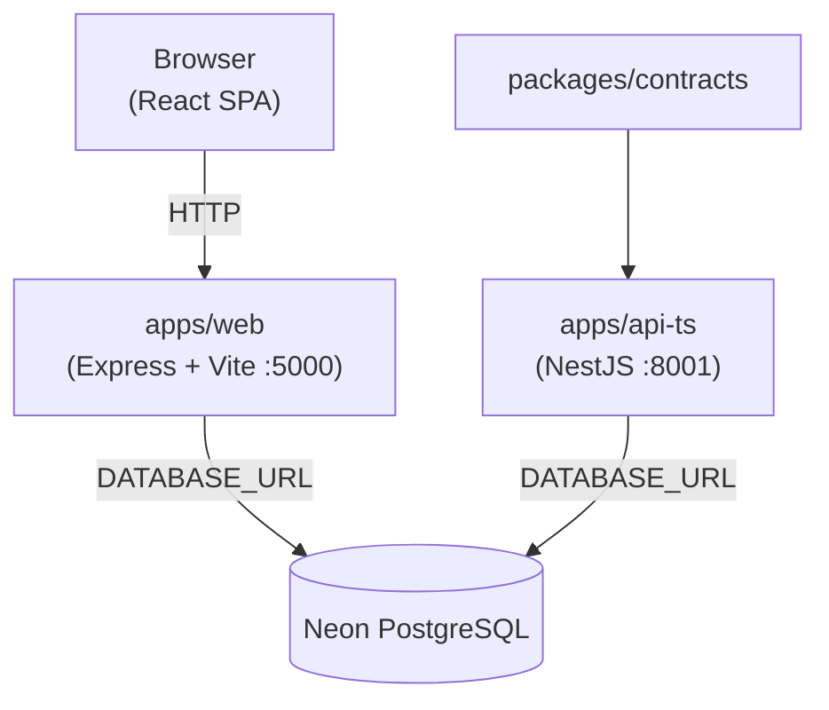

# CohortLens

**CohortLens** is a modular CRM analytics web platform that transforms customer data into actionable decisions. It provides customer segmentation, spending prediction, AI-powered recommendations, data drift monitoring, audit logging, consent management (SSI/Web3),A modular and comprehensive CRM analytics platform combining traditional and predictive insights. Prioritizing robust architecture, ethical AI practices, privacy, security, and scalability.

---

## Architecture Overview

CohortLens is a **pnpm monorepo** orchestrated by **Turborepo**, composed of two active applications and a shared contracts package.

```
CohortLens/
├── apps/
│   ├── api-ts/         # NestJS REST API — port 8001
│   └── web/            # React + Express + Vite web app — port 5000
├── packages/
│   └── contracts/      # Zod schemas + typed API client (shared)
├── deployment/         # Dockerfile + docker-compose
└── docs/               # Architecture, backend, product, deployment docs
```



---

## Stack

### `apps/web` — Web Application

| Layer | Technology |
|---|---|
| Runtime | Node.js + TypeScript (`tsx`) |
| Server | Express 5 |
| Bundler | Vite 7 |
| UI Framework | React 18 |
| Router | Wouter |
| Components | shadcn/ui (Radix UI primitives) |
| Styles | Tailwind CSS 3 |
| Data Fetching | TanStack Query v5 |
| Forms | React Hook Form + Zod |
| Charts | Recharts |
| Icons | Lucide React |
| ORM | Drizzle ORM + Neon Serverless |
| Themes | Light / Dark (pure black) |

### `apps/api-ts` — Backend API

| Layer | Technology |
|---|---|
| Framework | NestJS 10 |
| Language | TypeScript 5 (strict) |
| ORM | Prisma 6 + Neon PostgreSQL |
| Auth | JWT (HS256) via `@nestjs/passport` |
| Rate Limiting | `@nestjs/throttler` (1000 req/min general, 10 req/min auth) |
| AI | Groq API (`llama-3.3-70b`) with rule-based fallback |
| Docs | Swagger/OpenAPI at `/api/v2/docs` |
| Tests | Jest + Supertest (53 e2e tests) |

### `packages/contracts` — Shared

Zod validation schemas and a typed API client shared between apps.

---

## Features

| Module | Description |
|---|---|
| **Dashboard** | System health, DB status, IPFS node, and monthly API usage overview |
| **Spending Predictor** | XGBoost-based model predicts customer spending score from demographics |
| **Customer Segmentation** | K-Means clustering (k=3) with interactive scatter chart visualization |
| **AI Recommendations** | Chat interface powered by Groq LLM for natural-language cohort queries |
| **Data Drift Monitor** | PSI + Kolmogorov-Smirnov tests to detect feature distribution shifts vs. baseline |
| **Report Generator** | PDF/CSV/JSON reports with optional IPFS pinning for immutable storage |
| **Audit Log** | Immutable, searchable record of all system actions and data changes |
| **Consent Registry** | Self-Sovereign Identity (SSI/DID) based consent management and verification |
| **Web3 Infrastructure** | IPFS storage, zero-knowledge identity, and data tokenization engine |
| **API Usage** | Per-tenant monthly call tracking and quota monitoring |

---

## Quick Start

### Prerequisites

- Node.js 20+
- pnpm 8+
- A [Neon](https://neon.tech) PostgreSQL database

### Installation

```bash
git clone https://github.com/Jhuomar-Barria/CodeCrafters-United.git
cd CohortLens
pnpm install
```

### Web App (React + Express)

```bash
# Copy and configure environment variables
cp .env.example apps/web/.env
# Edit apps/web/.env: set DATABASE_URL (optional — mock data used if absent)

# Start development server (port 5000)
pnpm dev:web
```

Open `http://localhost:5000` in your browser.

### Backend API (NestJS)

```bash
# Copy and configure environment variables
cp apps/api-ts/.env.example apps/api-ts/.env
# Edit .env: set NEON_DATABASE_URL, JWT_SECRET, GROQ_API_KEY

# Generate Prisma client
pnpm prisma:generate

# Run database migrations
pnpm prisma:migrate

# Start development server (port 8001)
pnpm dev:api
```

Swagger docs available at `http://localhost:8001/api/v2/docs`.

### Run both apps simultaneously

```bash
# Terminal 1 — Web app
pnpm dev:web

# Terminal 2 — API
pnpm dev:api
```

### Build for production

```bash
pnpm build        # Build all apps via Turborepo
pnpm build:web    # Build web app only
```

---

## Environment Variables

### `apps/web/.env`

| Variable | Description | Required |
|---|---|---|
| `DATABASE_URL` | Neon PostgreSQL connection string | No (mock data used if absent) |
| `PORT` | Web server port | Default: `5000` |

### `apps/api-ts/.env`

| Variable | Description | Required |
|---|---|---|
| `NEON_DATABASE_URL` | PostgreSQL connection string (Neon) | Yes |
| `JWT_SECRET` | JWT signing secret | Yes |
| `GROQ_API_KEY` | Groq LLM API key | No (rule-based fallback) |
| `FEATURE_FLAG_V2_ENABLED` | Enable v2 API globally | Default: `false` |
| `FEATURE_FLAG_V2_PRIMARY` | Route all traffic to v2 | Default: `false` |
| `FEATURE_FLAG_V1_DEPRECATED` | Return 410 Gone for v1 endpoints | Default: `false` |
| `SKIP_DB` | Skip DB connection for local dev | Default: `false` |
| `PORT` | API server port | Default: `8001` |

---

## API Endpoints

### `apps/api-ts` — NestJS REST API

| Method | Path | Auth | Description |
|---|---|---|---|
| POST | `/api/v2/auth/token` | — | Get JWT token |
| GET | `/api/v2/health` | — | Service health check |
| GET | `/api/v2/usage` | JWT | API usage for current tenant |
| POST | `/api/v2/predict-spending` | JWT | Predict customer spending score |
| POST | `/api/v2/segment` | JWT | Segment customers (K-Means) |
| POST | `/api/v2/recommendations/natural` | JWT | AI recommendations (Groq LLM) |
| GET | `/api/v2/admin/flags` | — | Get feature flag state |
| POST | `/api/v2/admin/flags` | JWT | Set feature flag |
| POST | `/api/v2/admin/migrate-to-v2` | JWT | Trigger v2 cutover |
| POST | `/api/v2/admin/rollback-to-v1` | JWT | Emergency rollback to v1 |
| POST | `/api/v2/admin/enable-shadow-mode` | JWT | Enable shadow traffic mode |

### `apps/web/server` — Express API

| Method | Path | Description |
|---|---|---|
| GET | `/api/health` | Service + DB + IPFS status |
| GET | `/api/usage` | Tenant monthly call count |
| POST | `/api/predict` | Spending score prediction |
| GET | `/api/explain` | Feature importance (SHAP) |
| POST | `/api/segment` | K-Means cluster assignment |
| POST | `/api/recommendations` | AI recommendation query |
| GET | `/api/drift` | Data drift analysis (PSI + KS) |
| POST | `/api/drift/save` | Save new baseline |
| POST | `/api/reports` | Generate report (PDF/CSV/JSON) |
| GET | `/api/audit` | Audit log entries |
| POST | `/api/consent` | Register consent (SSI) |
| GET | `/api/consent/:id` | Get consents for a customer DID |

---

## Testing

```bash
# All tests
pnpm test

# Backend e2e tests (53 tests)
pnpm test:api

# TypeScript type checking
pnpm --filter @cohortlens/api-ts lint
pnpm --filter @cohortlens/web check
```

---

## Deployment (Docker)

```bash
# Build and run the API container
cd deployment
docker-compose up --build
```

The `docker-compose.yml` runs the NestJS API on port `8001` with a health check at `/api/v2/health`. Configure environment variables via a `.env` file at the project root.

```bash
# Required .env at project root for Docker
NEON_DATABASE_URL=postgresql://...
JWT_SECRET=your-secret
GROQ_API_KEY=gsk_...          # optional
FEATURE_FLAG_V2_ENABLED=true
FEATURE_FLAG_V2_PRIMARY=true
FEATURE_FLAG_V1_DEPRECATED=true
```

---

## Project Structure (detailed)

```
apps/
├── api-ts/
│   ├── src/
│   │   ├── main.ts                  # Bootstrap, CORS, Swagger
│   │   ├── app.module.ts            # Root module
│   │   ├── analytics/               # Predict, segment, recommendations
│   │   ├── auth/                    # JWT auth, guards, strategies
│   │   ├── common/                  # Admin controller, feature flags
│   │   └── prisma/                  # Prisma service + module
│   ├── prisma/
│   │   ├── schema.prisma            # DB models
│   │   └── migrations/              # SQL migrations
│   └── tests/e2e/                   # End-to-end test suites
│
└── web/
    ├── client/
    │   ├── index.html               # HTML entry point
    │   └── src/
    │       ├── App.tsx              # Router + providers
    │       ├── pages/               # 10 pages (dashboard → usage)
    │       ├── components/          # Layout + ~40 shadcn/ui components
    │       ├── hooks/               # use-cohort, use-theme, use-toast
    │       └── lib/                 # queryClient, utils
    ├── server/
    │   ├── index.ts                 # Express server entry point
    │   ├── routes.ts                # All REST handlers
    │   ├── storage.ts               # In-memory storage (audit + consent)
    │   ├── db.ts                    # Neon DB connection (Drizzle)
    │   └── vite.ts                  # Vite dev middleware
    └── shared/
        ├── schema.ts                # Zod schemas for all endpoints
        └── routes.ts                # Typed route definitions

packages/
└── contracts/
    ├── src/schemas.ts               # Shared Zod validation schemas
    ├── src/client.ts                # Typed API client
    └── src/index.ts                 # Package exports
```

---

## Documentation

- [Architecture](docs/architecture.md)
- [Backend](docs/backend.md)
- [Product](docs/product.md)
- [Deployment](docs/deployment.md)
- [Project Status](docs/PROJECT-STATUS.md)

---

**Team:** CohortLens Development Team
| Role | Name | Profession |
|---|---|---|
| Backend | Cesar Prens | Software Developer & Cybersecurity Technician |
| Backend | Emily Morales | Computer and Systems Engineering |
| Backend | Jhuomar Barría | Computer and Systems Engineering |
| Design | Ana Zárate | Industrial Engineering and Medicine |
| Design | Victoria Vargas | Management Information Systems Engineering |

---

## License

MIT License. See [LICENSE](LICENSE).
